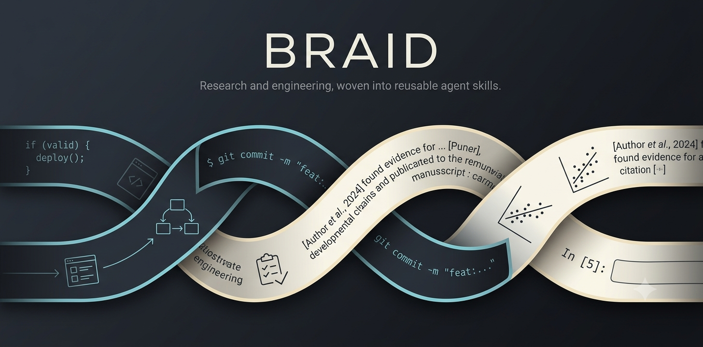

# braid



Two strands. One skill collection.

`braid` is an open-source collection of reusable Agent Skills for software
engineering, research, and scientific publication. The categories organize the
source tree only. Installed skill names remain flat.

## Skills

### Software engineering

- `engineering-plan-ontology`: creates and maintains evidence-driven
  engineering plans that autonomous agents can execute safely.
- `notebook-workflow`: edits, synchronizes, and validates Jupyter notebooks,
  including paired Jupytext sources.

### Research and publication

- `manuscript-revision`: revises scientific manuscripts while keeping claims,
  evidence, terminology, figures, and journal positioning aligned.
- `paper-support-release`: builds and audits reader-facing repositories,
  archives, and deposits that support scientific papers.
- `research-memo-maintainer`: maintains a chronological, experiment-first
  research record with explicit provenance and claim boundaries.

## Install

Install from GitHub with [`skills`](https://skills.sh):

```bash
npx skills add hermann-web/braid
```

Inspect the available skills without installing them:

```bash
npx skills add hermann-web/braid --list
```

Install one skill:

```bash
npx skills add hermann-web/braid --skill manuscript-revision
```

```bash
npx skills add hermann-web/braid --skill engineering-plan-ontology
```

Use `npx skills list` to inspect skills installed for the current project, or
`npx skills list -g` for global installations.

## Structure

```text
skills/
├── software-engineering/
│   ├── engineering-plan-ontology/
│   └── notebook-workflow/
└── research-publication/
    ├── manuscript-revision/
    ├── paper-support-release/
    └── research-memo-maintainer/
```

Each skill is self-contained under `skills/<category>/<skill-name>/`. A skill
always has `SKILL.md` and may include only the scripts, references, or assets it
needs.

## Contributing

Read [CONTRIBUTING.md](CONTRIBUTING.md) before proposing a skill. New skills
must be reusable outside one repository, have precise activation boundaries,
and pass local `npx skills` discovery.

## Licence

`braid` is available under the [MIT License](LICENSE).
